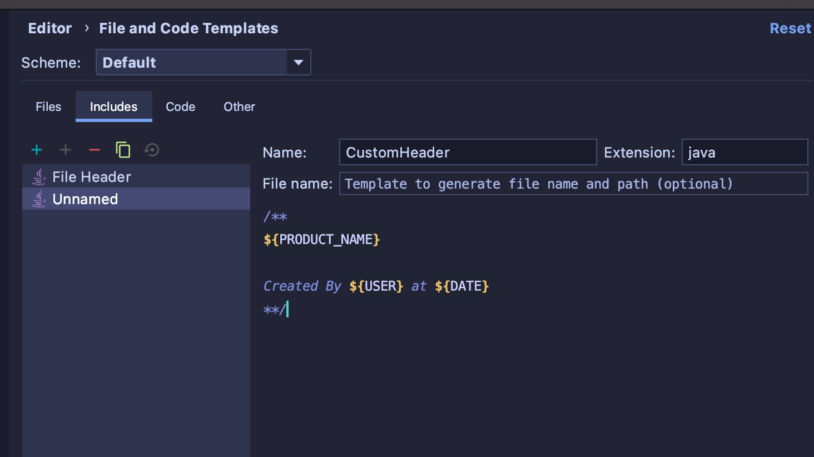
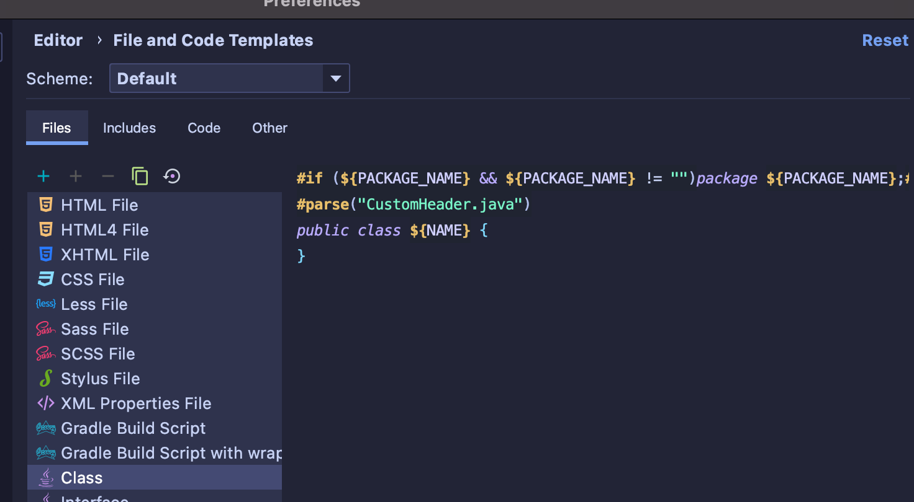

주석 
--

주석은 유용하다.  
**하지만 코드로 의도를 분명하게 표현하는것은 더 유용하다.**

자신의 코드가 이해하기 어렵고 지저분하다면  
주석을 상세히 달기보다는 주석이 필요하지 않도록 코드를 정리하는데 노력을 쏟는 편이 더 유용하다는 것이다.

## 좋은 주석

주석은 일반적으로 나쁘게 사용되는 경우가 많다.  
위에서 이야기한 코드로 의도를 표현하지 못해 작성한 주석이나, 코드의 변화와 함께 관리되지 않은 주석이 그렇다.  
하지만 좋은 주석도 있다. 살펴보자.  

**1. 법적인 주석** 

   Copyright 같은 저작권 및 소유권 정보는 들어가야 마땅하다. IDE 에서 파일 생성시 자동으로 붙일 수도 있다.
   
> **IntelliJ 기준 파일 주석 헤더 추가 방법** 
 Command + Shift + A -> file template 검색 후 includes 수정

원하는 포맷에 맞는 파일에 해당 템플릿 추가

**2. 의도를 설명하는 주석**

   가끔은 코드로 의도가 표현되지 않을 경우가 있다.  
   주로 성능을 위하여, 혹은 무언가를 공통모듈로 만들때 작성자의 의도를 알지 못하는 3자가 보기에는 왜 이런 코드가..? 싶은 코드가 생성된다.  
   이런 경우 사용하는 주석은 일반적으로 합당하다.
   
**3. 결과를 경고하는 주석**  

   사용할때 주의를 요하는 코드에 붙인 경고 주석은 의미가 있다.  
   일반적으로 그런 코드를 작성하지 않는 편이 가장 좋지만, 필요할 때가 있다.  
   >내 경험으로는 전 직장에서 사용하던 리얼 서버 과금 테스트코드가 있었다.   
   특정한 사용자가 제공하지 않는 방법으로 결제를 꼭 하고싶다고 할때 개발자가 테스트 코드를 수행해 결제를 수행해주곤 했었다.  
   어드민 기능으로 추가되면 좋지만 회사의 요구사항 없이 함부로 추가할 수는 없으니까..  
   이런 경우 경고 주석이 없다면 새로 들어온 개발자는 테스트 코드를 수행하여 시스템을 익히곤 하는데, 대형 사고가 날 수도 있는 부분이었다.
   
**4. TODO**  

   TODO 는 매우 유용하다. 
   여기서도 자주 듣는 말이 있다. "지금은 바쁘니까"    
   사실 처음부터 리팩토링을 거듭하면서 코드를 작성하는게 더 작업속도가 빠르다고 생각하지만, 그러지 못하는 경우도 있다.  
   혹은 설계적인 부분이 들어가 당장 해결하기는 어려운 문제들이 있다. TODO 는 이런 문제들을 잊지 않고 처리하게 해준다.
   > IntelliJ 하단에 보면 TODO 버튼이 있다. 이 버튼을 누르면 모든 TODO 를 보여준다.  
   > 또 IntelliJ 에서 커밋을 치면, 처리되지 않은 TODO가 존재한다는 경고창을 띄워준다.
   
**5. 강조**  

   코드상 매우 중요한 부분에 대하여 주석으로 표시할 수도 있다.  
   이와 같은 주석은 코드를 3자가 변경할 때, 매우 중요한 로직을 대수롭지 않다고 지우는 불상사를 방지한다.  
 
**6. Javadocs** 

   공개 API 를 구현한다면 Javadocs 는 매우 중요하다.  
   우리도 새로운 라이브러리나 API 를 도입한다면 Javadocs 를 통하여 익히니까.  
   
위의 좋은 주석 역시 그릇된 정보를 전달하지 않도록 작성시에도 충분한 신경을 써야하고, 항상 코드와 함께 업데이트 되어야한다.

## 나쁜 주석

이번엔 대다수의 주석이 포함되는 나쁜 주석을 알아보자

**1. 의도를 분명히 드러내지 못한 주석** 

   레거시 코드의 일부다. 위 소스를 보고 DB 새로 받아오기의 의미를 이해할 수 있을까?  
   주석은 항상 신중히, 독자를 배려하여 작성하여야 한다.
   
**2. 코드와 같은 이야기를 반복하는 주석, 있으나 마나한 주석**

필드 이름을 한글로 반복한다거나. 

메서드 명과 필드가 이미 의도를 드러내는데 중복하는 주석은 오히려 읽는 시간만 증가시킨다.  

 > 함수나, 변수로 표현이 된다면 주석을 달지말자. 1,2 번의 모든 예제들은 그러한 케이스를 포함한다.   
   
**3. 오해의 여지가 있는 주석**

 열심히 작성하였으나, 주석이 소스의 의도를 아주 살짝 틀리는 경우가 있다. 주석으로 소스를 설명할때는 항상 숙고하여 주석을 작성하자.  
   
**4. 주석에 의무를 부여하는 경우**

   책에서는 모든 메서드의 JavaDocs를 작성하라는 규칙을 예로 들었다.
   이러한 규칙은 소스를 변경할때, 주석도 수정해야하는 2배의 노력을 부어야한다.
   코드는 혼동을 주는 주석으로 가득해질 것이다.
   > 개인적으로 JavaDocs는 굳이 작성을 해야한다면 Interface 에만 작성하는 것이 옳다고 생각한다.  
   Concrete 클래스는 변화도가 크기 때문에 주석까지 수정해야 하는 경우를 만들면 굉장히 피곤하다.
   또한 외부에 공개할 코드가 아니라면 절대 작성하지 말자.
   
**5. 닫는 괄호에 다는 주석**

   닫는 괄호를 찾기 힘들어 주석으로 표기하는 경우가 있다.  
   이런 경우는 코드를 충분히 줄일 리팩토링의 신호라고 생각하는 편이 본인에게 팀에게 이롭다.  
   
**6. 주석으로 처리한 코드**

   코드를 주석으로 처리해야한다면 과감히 지우자.
   우리는 Git의 시대에 살고있다..
   
**7. HTML 주석**

   주석은 읽기 쉬워야한다. 문서화를 위해 HTML 태그를 넣는것은, 툴이 할일을 사람이 대신하는 주객전도다.
   
**8. 전역 정보**

   주석은 근처에 있는 코드만 서술해야한다. 계속 말해왔지만 주석을 한번 달았다면 소스와 주석을 함께 관리해야한다.  
   주석이 해당하는 소스와 멀리 떨어져 있다면, 그 주석은 관리되지 않게 될 가능성이 매우 커진다.  
   
--
## 느낀점
오랜만에 Clean Code를 다시보면서 이전 회사에서 위에 기술된 거의 모든것을 하고, 강요해서 열심히 설득을 했던 기억이 납니다..  
가끔은 그저 팀의 룰을 따르는 것 보다도, 더 좋은 방향으로 함께 갈 수 있도록 변화를 주는 것도 더 좋은 팀을 만드는 방법이 될 수 있지 않은가 하는 생각이 듭니다.
지금 하는 스터디가, 귀찮게 생각될 수 있겠지만 모두에게 좋은 의미가 되었으면 좋겠습니다. -젊은 꼰대-