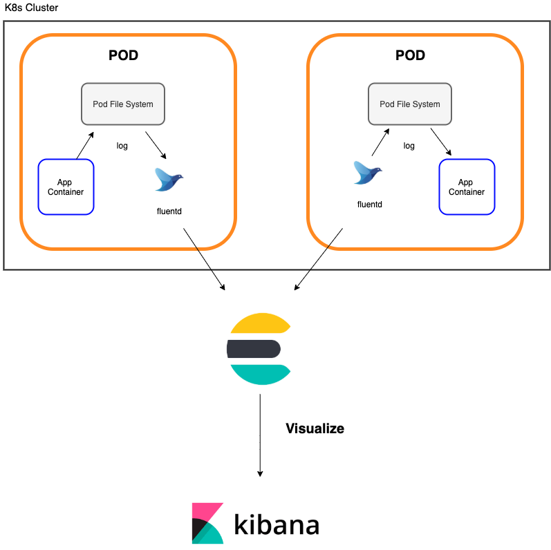

## EFK ?

Elasticsearch + Fluentd + Kibana 로 구성하는 로깅시스템

Fluentd 로 로그를 수집, Elasticsearch에 저장, Kibana 로 시각화

### EFK in EKS

---

Fargate 를 이용하지 않는 일반적인 k8s 에서의 efk 구성은 DaemonSet 을 이용하여 fluentd 를 모든 노드에 배포하면 간단하지만,  
Fargate 에서는 DaemonSet 사용이 불가능하므로 sidecar 패턴으로 구성을 하여야한다.

>**DaemonSet?**  
클러스터 전체 혹은 특정 조건을 만족하는 모든 노드에 포드를 띄울때 사용하는 Object  일반적으로 로그수집기나, 노드 모니터링에 사용한다.  
  
     
     
  
>**k8s sidecar pattern**  
k8s 에서는 몇가지 아키텍쳐 디자인패턴을 소개하는데, 여기에서는 그 중 하나인 sidecar 패턴을 이용한다.  
Sidecar 패턴이란 오토바이 옆에 붙이는 보조석처럼  
한 파드내에 메인 컨테이너와 함께 *독립적으로* 동작하는 보조 컨테이너를 같이 배치시키는 패턴이다.  
각각의 컨테이너는 독립적으로 동작하므로  
각각의 컨테이너에 단일 책임부여만 확실히 한다면  
언제든지 확장이나 축소, 버전업이나 다른서비스로 교체등이 가능하다는 장점이 있다.  
여기서는 위 그림 처럼 두개의 컨테이너가 동일한 파일시스템을 공유하도록하여 로깅시스템을 구축할 것이다.

- **구성도**  
---
  


일반적으로 별도의 ES를 설치한 VM 인스턴스를 이용하는 경우 중간에 Redis 와 로그수집기를 하나 더 두어

중앙 로그처리 서버 역할을 하도록하여 Queueing 을 통해 ES의 부하를 줄이지만, AWS ES를 이용하는 경우,

ES 자체의 고가용성과 자동 확장이 보장되므로 굳이 필요하지 않다고 판단하였다.

이후 부하테스트를 해보고 구축 여부를 판단하도록 하면 될 듯하다.

elasticsearch 클러스터와 k8s 클러스터는 이미 올라가있다고 생각하고 설명한다.  
  
  
- **구축**
---
**1. Fluentd 가 구동될 컨테이너 구성 Dockerfile 작성**

```
FROM ubuntu:16.04
RUN apt-get update
RUN ulimit -n 65536
RUN apt-get install -y curl
RUN curl https://packages.treasuredata.com/GPG-KEY-td-agent | apt-key add -
RUN echo "deb http://packages.treasuredata.com/3/ubuntu/xenial/ xenial contrib" > /etc/apt/sources.list.d/treasure-data.list
RUN apt-get update && apt-get install -y -q curl make g++ && apt-get clean && apt-get install -y td-agent && rm -rf /var/lib/apt/lists/* /tmp/* /var/tmp/*
RUN sed -i -e "s/USER=td-agent/USER=root/" -e "s/GROUP=td-agent/GROUP=root/" /etc/init.d/td-agent
RUN /usr/sbin/td-agent-gem install fluent-plugin-aws-elasticsearch-service -v 2.2.0
CMD /usr/sbin/td-agent $FLUENTD_ARGS

```

***설명***

ubuntu 이미지를 기반으로 fluentd 와 aws-elasticsearch-service 플러그인을 설치시키고

FLUENTD_ARGS 라는 이름으로 저장된 환경변수를 옵션으로 td-agent를 실행시킨다.

생성한 이미지를 ecr 등 이미지 저장 버킷에 푸쉬한다.

**2.Fluentd 가 올라가있는 컨테이너에서 사용할 세팅값들을 ConfigMap 이나 Secret 으로 .**

우선 로그수집 설정을할 td-agent.conf 에 들어갈 내용을 ConfigMap으로 생성한다.

`kubectl create cm <cm-name>`

`kubectl edit cm <cm-name>`

``` bash
apiVersion: v1
data:
  td-agent.conf: |-
    <source>
    @type tail
    format none
    path /app/log/docswave-app.log
    pos_file /var/log/docswave-app.log.pos
    tag docswave.applog
    </source>
    <match docswave.**>
     @type "aws-elasticsearch-service"
     logstash_format true
     include_tag_key true
     tag_key "@log_name"
     reload_connections false
     reconnect_on_error true
     reload_on_failure true
     flush_interval 1s
     <endpoint>
       url https://search-testpublic-6ka5nqs7jgpmuiyd5kbbefyd6y.ap-northeast-2.es.amazonaws.com
       region ap-northeast-2
       access_key_id "#{ENV['AWS_ACCESS_KEY']}"
       secret_access_key "#{ENV['AWS_ACCESS_SECRET']}"
     </endpoint>
     </match>
kind: ConfigMap
metadata:
  creationTimestamp: "2020-12-28T02:08:36Z"
  name: fluentd-config
  namespace: kubetest
  resourceVersion: "5157542"
  selfLink: /api/v1/namespaces/kubetest/configmaps/fluentd-config
  uid: 6f94d99a-e9b2-4d4a-97b7-58bea25e1a39

```

td-agent.conf 의 문법은 공식문서 ([https://docs.fluentd.org/configuration/config-file](https://docs.fluentd.org/configuration/config-file)) 를 참조한다.

***설명***

<source>/app/log/docswave-app.log 로그 파일을 tail 로 읽어

<match> 의 옵션에따라 endpoint 아래에 있는 aws-elasticsearch 로 수집한 로그를 flush 한다.

endpoint 아래에 있는 aws 계정값같은 보안이 필요한 데이터는 Secret을 이용하여 환경변수로 등록하여 사용한다.

``` bash
kubectl create secret generic aws-account-secret \
  --from-literal=<AWS_ACCESS_KEY>=<key> \
  --from-literal=<AWS_ACCESS_SECRET>=<secret>
```

**3.생성한 Secret, ConfigMap을 컨테이너의 환경변수로 등록**

``` bash
apiVersion: apps/v1
kind: Deployment
metadata:
  annotations:
    deployment.kubernetes.io/revision: "10"
  generation: 10
  labels:
    app: testdeployment
    namespace: kubetest
  name: testdeployment
  namespace: kubetest
  resourceVersion: "5157866"
  selfLink: /apis/apps/v1/namespaces/kubetest/deployments/testdeployment
  uid: f9270147-9c4f-4a31-851c-8d70c46d96e6
spec:
  progressDeadlineSeconds: 500
  replicas: 1
  revisionHistoryLimit: 10
  selector:
    matchLabels:
      app: testdeployment
      namespace: kubetest
  strategy:
    rollingUpdate:
      maxSurge: 25%
      maxUnavailable: 25%
    type: RollingUpdate
  template:
    metadata:
      creationTimestamp: null
      labels:
        app: testdeployment
        namespace: kubetest
    spec:
      affinity:
        nodeAffinity:
          requiredDuringSchedulingIgnoredDuringExecution:
            nodeSelectorTerms:
            - matchExpressions:
              - key: beta.kubernetes.io/arch
                operator: In
                values:
                - amd64
                - arm64
      containers:
      - image: 894538594166.dkr.ecr.ap-northeast-2.amazonaws.com/test-repo
        imagePullPolicy: Always
        name: test-repo
        resources: {}
        terminationMessagePath: /dev/termination-log
        terminationMessagePolicy: File
        volumeMounts:
        - mountPath: /app/log
          name: log-volume
      - env:
        - name: FLUENT_ARGS
          value: -c /etc/td-agent/td-agent.conf --use-v1-config
        - name: AWS_ACCESS_KEY
          valueFrom:
            secretKeyRef:
              key: AWS_ACCESS_KEY
              name: aws-account-secret
        - name: AWS_ACCESS_SECRET
          valueFrom:
            secretKeyRef:
              key: AWS_ACCESS_SECRET
              name: aws-account-secret
        - name: AWS_ACCOUNT
          valueFrom:
            secretKeyRef:
              key: AWS_ACCOUNT
              name: aws-account-secret
        image: 894538594166.dkr.ecr.ap-northeast-2.amazonaws.com/fluentd
        imagePullPolicy: Always
        name: fluentd-sidecar
        resources: {}
        terminationMessagePath: /dev/termination-log
        terminationMessagePolicy: File
        volumeMounts:
        - mountPath: /app/log
          name: log-volume
        - mountPath: /etc/td-agent
          name: config-volume
      dnsPolicy: ClusterFirst
      restartPolicy: Always
      schedulerName: default-scheduler
      securityContext: {}
      terminationGracePeriodSeconds: 30
      volumes:
      - emptyDir: {}
        name: log-volume
      - configMap:
          defaultMode: 420
          name: fluentd-config
        name: config-volume

```

예제로 만든 Deployment 이다.  살펴보아야 할 부분은 containers 아래의 설정들이다.

***설명***

1.test-repo 라는 applicaiton 컨테이너 와 함께 fluentd 컨테이너를 설정해둔것을 볼 수 있다.

2.applicaiton 컨테이너에서 log 파일이 저장되는 디렉토리를를 볼륨으로 등록하고, 로그 수집을 위하여 fluentd 컨테이너에 해당 디렉토리를 마운트 시킨다.

3.env 아래에 fluentd 설정을 위한 환경변수들을 등록해준다. 여기서는 aws 계정정보를 저장한 secret과 fluentd 실행 옵션이 등록되어 있는것을 확인할 수 있다.

4.volumes 아래에 위에서 생성한 td-agent.conf 에 들어갈 값들이 저장되어 있는 configmap을 볼륨으로 등록하고, 해당 볼륨을 /etc/td-agent에 마운트 시킨다.

---
여기까지 완료하면, application 컨테이너와 fluentd 컨테이너가 하나의 포드에 떠 있는것을 확인할 수 있을것이다.

이제 aws-elasticsearch로 가서 확인해보면 끝.

정상적으로 수집이 되지 않았다면,  

`kubectl logs <pod-name> -c <fluentd container-name>`

으로 확인해보면 된다.

이제 위에서 작성한 Configmap에 있는 td-agent.conf 의 값만 변경해주면 원하는대로 로그를 작성할수있다.
