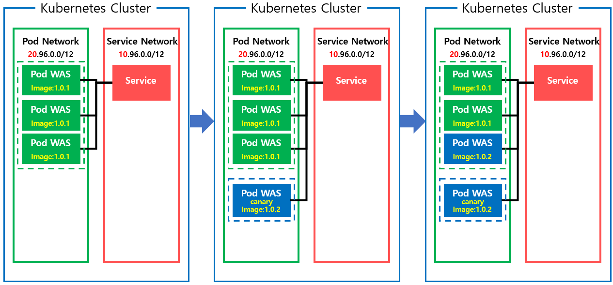

Kubernetes 무중단 배포
--

### Probe 
무중단 배포를 구성하기 이전에 Probe 를 알아야한다.

**Probe?**  
Probe 란 컨테이너의 라이프사이클에 대한 권한이 있는  
kublet에 의해 주기적으로 수행되는 컨테이너 Health Check 이다.

**종류**  
Probe 는 3가지 종류가 있다. 각 프로브는 HealthCheck 를 통과하지 못했을 경우, 특정한 동작을 한다.  
1. **livenessProbe**  
livenessProbe는 컨테이너의 동작여부를 나타낸다.   
만약 이 Probe의 상태확인을 통과하지 못한다면, 해당 컨테이너는 재시작정책에 따라 처된다.
2. **readnessProbe**  
readnessProbe는 컨테이너가 요청을 처리할 준비가 되었는지를 나타낸다.  
이 Probe의 상태확인이 실패하면, 해당 컨테이너가 있는 파드에 연결되어 있는 모든 서비스들의 엔드포인트에서 해당 파드의 IP를 지운다.  
즉 헬스체크를 통과할때 까지, 해당 파드로의 트래픽을 차단한다.
3. **startUpProbe**  
startUpProbe는 컨테이너 내부의 어플리케이션의 준비되었는지를 나타낸다.  
동작은 livenessProbe와 똑같이 컨테이너를 재시작정책에 따라 처리하지만,  
차이점은 해당 Probe는 통과되기 전까지 다른 Probe의 실행을 중지시킨다.

 

### Kubernetes 배포전략 

쿠버네티스는 기본적으로 3가지 배포전략을 지원한다.  
1. RollingUpdate
2. Blue/Green Update
3. Canary Update 

---
### 각 배포 전략의 작동방식  
-  **RollingUpdate**  
  

K8s 의 RollingUpdate는 다음과 같이 진행된다.  
1. ReplicaSet 을 복제
2. 복제한 ReplicatSet 에서 동시생성 설정한 갯수만큼의 Pod를 생성
3. 생성한 Pod의 HealthCheck 가 통과하면, 그 갯수만큼 기존의 Pod를 중지
4. 2번부터 모든 파드가 새로운것으로 교체될때까지 반복

RS 를 추가적으로 생성해야하는 자원외에는 추가자원이 필요하지 않고 설정이 단순하다는 장점이 있지만  
구버전과 신버전이 공존하는 시간이 있다는 점과 롤백시 역순을 거쳐야해 롤백이 오래걸린다는 단점이 있다.


- **Blue/Green Update**

K8s 의 Blue/Green 배포는 labelSelector 를 이용하여 진행된다.
1. 기존 버전은 Blue label 로 생성되어있다.
2. Deployment 설정을 변경해 신규 버전을 Green label로 추가로 생성한다.
3. Inress Service의 labelSelector를 Blue에서 Green 으로 변경한다. 

모든 파드를 생성해놓은 후, 로드밸런서를 연결해둔 Ingress 를 통해 트래픽만 한번에 교체하므로,  
버전이 공존하여 발생하는 문제가 없고 Ingress의 라벨만 교체하면 롤백역시 단순하다는 장점이 있다.  
하지만 클러스터의 리소스가 두배로 든다는 단점이 있다. 


- **Canary 배포**

Canary 배포 역시 label 을 이용한다.
1.배포에 Service 가 바라볼 label 이외에 버전을 명시할 label 을 추가한다.
2.Service가 바라보는 label 을 포함하고 버전만 변경한 Deployment 를 추가한다.
3.추가한 Deployment의 replica 수를 점점 조절해나간다.
4.일정 비율이상이 넘을때 까지 오류가 발견되지 않는다면, 새로운 버전으로 완전히 교체한다.

신규 버전에 문제가 생겼을때, 모든 사용자에게 해당 오류를 노출시킬수 있는 위험부담이 최소화된다.
하지만 배포에 많은 시간을 들여야하며, 결국 특정사용자는 오류를 경험해야한다는 단점이 있다. 
---
  
 ### 설정 및 Rollback 처리  
  
 다른 배포방식들은 위에서 기술한대로 label을 컨트롤 하여 배포하므로 생략하고 RollingUpdate에 대해서만 별첨한다.   
 - **RollingUpdate**  
 Deployment에 옵션과 Probe만 설정하면 수행할 수 있다.  
 
 _*1. Deployment 수정*_   
 ``kubectl edit deployments <name> -n <namespace>``
   
_*2. Deployment의 spec 하단에 다음을 작성한다.*_  
 ``` bash
  strategy:  
       rollingUpdate:
         maxSurge: 25%
         maxUnavailable: 25%
       type: RollingUpdate  
```  
maxSurge : 한번에 생성할 수 있는 Pod의 수  
maxUnavailable: 한번에 unAvailable 로 만들 수 있는 Pod의 수  
>두 옵션 모두 고정값이나 % 모두 설정이 가능하다.  
> 
_*3. Deployment의 templates 하단의 컨테이너 설정에 무중단 배포를 위한 Probe를 설정한다.*_  
 ``` bash
  livenessProbe:
    failureThreshold: 1
    httpGet:
      path: /health
      port: 8080
      scheme: HTTP
    initialDelaySeconds: 120
    periodSeconds: 10
    successThreshold: 1
    timeoutSeconds: 2
  readinessProbe:
    failureThreshold: 1
    httpGet:
      path: /health
      port: 8080
      scheme: HTTP
    initialDelaySeconds: 15
    periodSeconds: 10
    successThreshold: 1
    timeoutSeconds: 2
 ```  
initialDelaySeconds: 첫 번째 프로브 전에 컨테이너가 작성된 후에 kubelet가 대기하는 시간  
periodSeconds: kubelet이 서비스를 프로브하는 주기. Default 1
timeoutSeconds:	프로브의 timeout. Default 1  
successThreshold: 실패 후 프로브가 성공해야 하는 횟수. Default 1  
failureThreshold: Kubernetes가 파드가 시작되고 프로브가 실패할 때 파드를 재시작 시키는 최대 실패횟수 min 1, max 3

 
