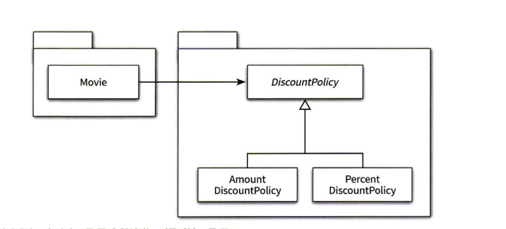
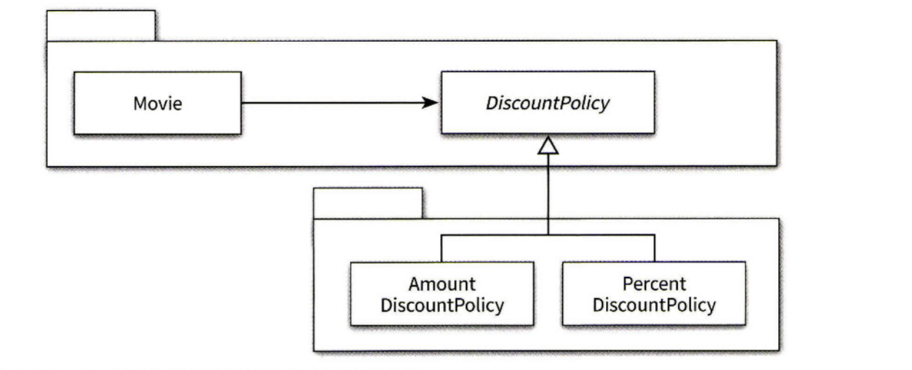

OBJECT - Chapter 9 유용한 설계
---

### OCP 개방 폐쇄 원칙 - **확장에는 열려있고 변경에는 닫혀있어야한다.**
기존 코드를 수정하지 않고, 새로운 동작을 추가하는 원칙.  
컴파일타임 의존성을 고정시키고 런타임 의존성을 변경함으로서 달성할 수 있다.

즉 **추상화에 의존하라**  

변하지 않는 부분을 고정하고 변히는 부분을 생략하는 추상화 메커니즘을 따르라.  
수정에 대한 영향을 최소화하기 위해서는 **모든** 요소가 추상회에 의존해야 한다.  

하지만 무작정 추상화 하는것이 아니다.  
**변하는 것과 변하지 않는 것이 무엇인지를 이해하고 이를 추상화의 목적으로 삼아야한다.**

### 생성사용 분리

알아야 하는 지식이 많으면 결합도도 높아진다.   
그 중에서도 특히 객체 생성에 대한 지식은 과도한 결합도를 초래하는 경향이 있다.

한 객체 내부에서 다른 객체를 생성 자체는 문제가 되지 않는다.  
핵심은 통일한 클래스 안에서 객체 생성과 사용 이라는 두가지 목적을 가진 코드가 공존하는 것이 문제라는 것이다.  

#### 두 가지 책임을 서로 다른 객체로 분리하라
- 생성의 책임을 클라이언트로 옮기기 - 가장 쉬운 방법
- Factory 추가하기 - Client 도 생성에 대한 책임도 어떠한 지식도 가지고 싶지 않을때 사용한다.  

**크레이그 라만의 시스템을 객체로 분해하는 2가지 방법**
- 표현적분해 - 도메인에 존재하는 사물이나 개념을 이용해 시스템을 분해하는것. 설계의 시작    
- 행위적 분해 - 도메인에 존재하지 않지만, 필요에 의해 분해하는것  

Factory 와 같이 책임 할당을 위해 창조되는, 도메인과 무관한 인공적인 객체를 **PURE FABRICATION** 이라고 한다.  
어떤 행동을 추가하고 싶지만, 책임을 가져갈 마땅할 도메인이 없다면 PURE FABRICATION 을 추가하고 책임을 할당하라.  

### 의존성 주입

외부의 독립적인 객체가 스턴스를 생성한 후 이를 전달해서 의존성을 해결하는 방법을 의존성 주입이라고 한다.  

의존성을 객체의 **퍼블릭 인터페이스에 명시적으로** 드러내서 외부에서 필요한 런타임 의존성을 전달할 수 있도록 만드는 방법

##### 의존성 주입의 3가지 방법  

- 생성자 주입: 객체들 생성하는 시점에 생성자를 통한 의존성 해결   
- setter 주입: 객체 생성 후 setter 서드를 통한 의존성 해결, 언제든지 의존 대상을 교체할 수 있으나, setter 메서드가 호출되기 전에는 객체는 비정상적인 상태로 생성된다.  
- 메서드 주입: 메서드 실행 시 인자를 이용한 의존성 해결 - 메서드가 의존성을 필요로 하는 유일한 경우일 때 시용할 수 있다.  

#### 숨겨진 의존성은 나쁘다.

의존성을 구현 내부로 감출 경우 의존성과 관련된 문제가 컴파일타임이 아닌 **런타임에 가서야 발견된다.**
가능하다면 의존성을 명시적으로 표현할 수 있는 기법을 사용하라. 의존성을 public 인터페이스에 드러내자. 
의존성 주입은 의존성을 명시적으로 명시할 수 있는 방법 중 하나일 뿐이다.

### 의존성 역전 원칙
상위 수준의 클래스가 하위 수준의 클래스에 의존한다변 하위 수준의 변경에 의해 상위 수준 클래스가 영향을 받게 될 것이다.

**상위 수준의 클래스는 어떤 식으로든 하위 수준의 클래스에 의존해서는 안된다.**

대부분의 경우 우리가 재사용하려는 대상은 상위 수준의 클래스다.    
상위 수준의 클래스가 하위 수준의 클래스에 의존하면 상위 수준의 클래스를 재사용 할 때 하위 수준의 클래스도 필요하기 때문에 재사용하기가 어려워진다.  
항상 상위 수준으로 의존 방향이 흘러야한다.  

- 상위 수준의 모률은 하위 수준의 모률에 의존해서는 안 된다. 둘 모두 추상화에 의존해야 한다.
- 추상화는 구체적인 사항에 의존해서는 안 된다. 구체적인 사항은 추상화에 의존해야 한다.

이를 의존성 역전 원칙이라고 한다. 
> 절차적 프로그래밍과는 반대방향으로 나타나기 때문에 명명 된 이름이라고 한다.

####의존성 역전 원칙과 패키지
클래스 뿐만 아니라 패키지, 더 나아가 전체 시스템에도 각자 의존성이 있다.
언제나 의존성은 상위수준으로 흘러야한다.  

고전적인 패키지 구조이다. 하지만 위 구조는 컴파일 시점에서 문제점이 있다.  
Movie 를 빌드하려면 DiscountPolicy 가 포함된 패키지까지 함께 배포해야한다는 점이다.  

해결법은 단순하다.

추상화를 구체 클래스들과 분리하는 것이다.   
이러한 패턴을 **SEPARATED INTERFACE 패턴** 이라고 한다.  
의존성 역전 원칙에 따라 상위 수준의 협력 흐름을 재사용하기 위해서는 추상화가 제공히는 인터페이스의 소유권 역시 역전시켜야 한다.  

### 유연성에 대한 조언

유연한 설계는 유연성이 필요할 때만 옳다.
설계의 미덕은 단순함과 명확함으로부터 나온다. 변경하기 쉽고 확장하기 쉬운 구조를 만들기 위해서는 단순함과 명확함의 미덕을 버리게 될 가능성이 높다.  

미래에 변경이 일어날지도 모른다는 막연한 불안감은 불필요하게 복잡한 설계를 낳는다.  
아직 일어나지 않은 변경은 변경이아니다.  

유연한 설계를 단순하고 명확하게 만드는 유일한 방법은 사람들 간의 긴밀한 커뮤니케이션뿐이다.  
불필요한 유연성은 불필요한 복잡성을 낳는다. 단순하고 명확한 해법이 그런대로 만족스럽다면 유연성을 제거하라.   
유연성은 코드를 읽는 사람들이 복잡함을 수용할 수 있을 때만 가치가 있다.    

### 협력과 책임이 중요하다

우선 역할 책임 협력에 초점을 맞추자.  
핵심은 객체를 생성하는 방법에 대한 결정은 모든 책임이 자리를 잡은 후, 가장 마지막 시점에 내라는 것이 적절하다는 것.  

필자는 객체가 무엇이 되고 싶은지를 알게 될 때까지 객체들을 어떻게 인스턴스 화할 것인지에 대해 전혀 신경 쓰지 않는다고 한다.    
가장 중요한 관심거리는 마치 객체가 이미 존재하는 것처럼 이들 간의 관계를 신경 쓰는 일이다.  
